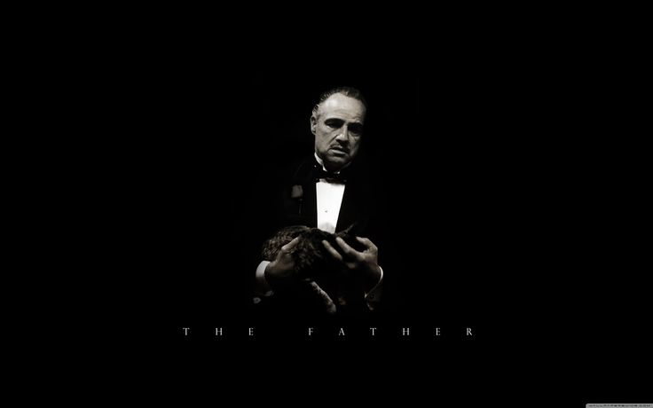

# Mafia Game

In spring 2021 I selected advanced programming course in [AUT](https://aut.ac.ir). 
This course had delivery projects for mid-term, and final term. 
This is the mid-term project. 
In this project we were tasked to create a command line version of Mafia party-game. 
The Lab practices can be found [here](https://github.com/Noisyboy-9/java_lab)  
The homeworks can be found [here](https://github.com/Noisyboy-9/mafia_game)  

## project structure

This game uses TCP/IP server with at least 10 clients each connecting to the server as different roles and playing their
part in the game.

## roles in the game

The game has two main category of roles:

1. Mafias
2. Citizens

### mafias

The game supports these roles in the mafia group:

- God Father 
- Doctor Lector 
- Normal Mafia 

### citizens

The game supports these roles in the citizen group:

- Inspector
- City Doctor
- Mayor
- Die hard
- Psychiatrist
- Normal Citizen

### bonus features

I have tried to implement a some bonus features listed below to get more additional points helping me get better grade,
which some of them are:

- Nice ui
- chat supports persian typing
- efficient UML design

The uml design of the projects can be
seen [here](https://drive.google.com/file/d/1pTdG8LWaKUNOZtUQBmiXLnBXyITGuU2s/view?usp=sharing) 

